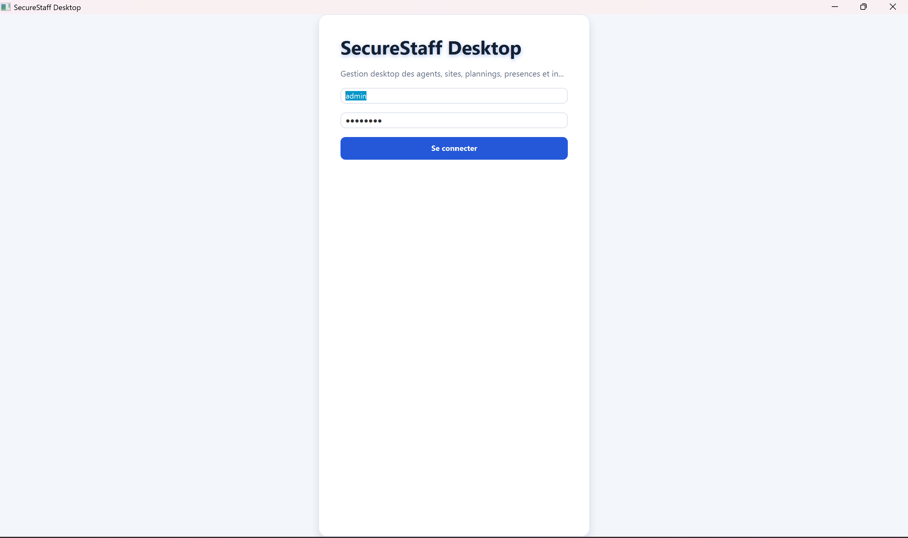
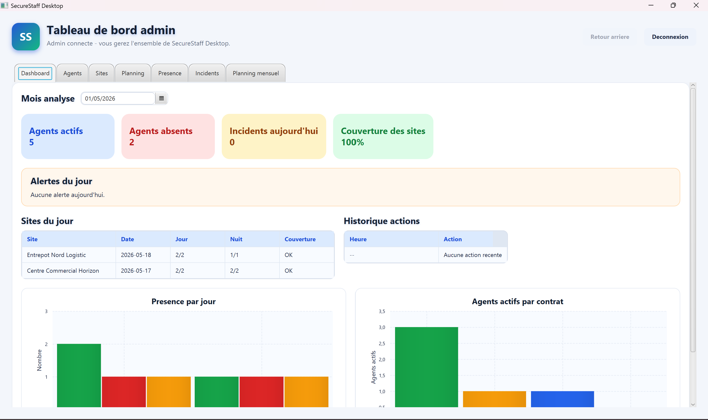
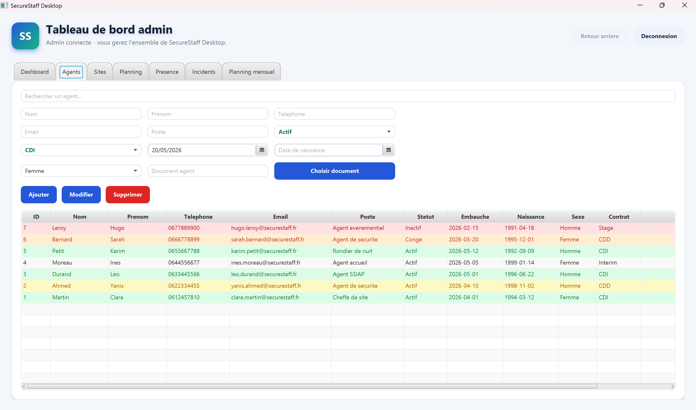
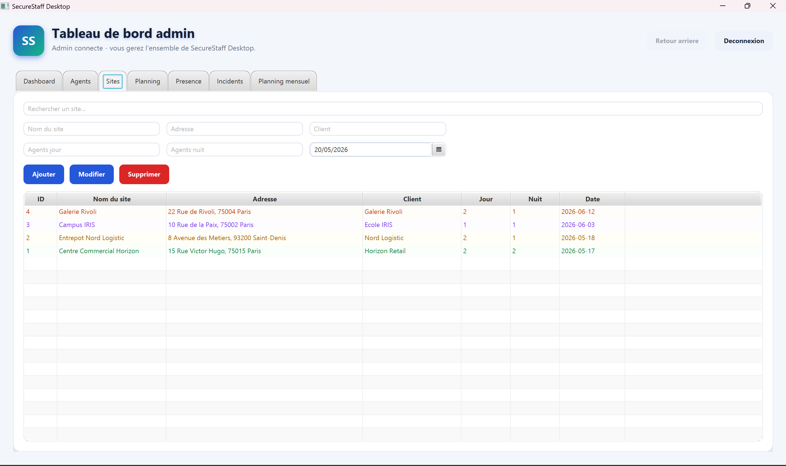
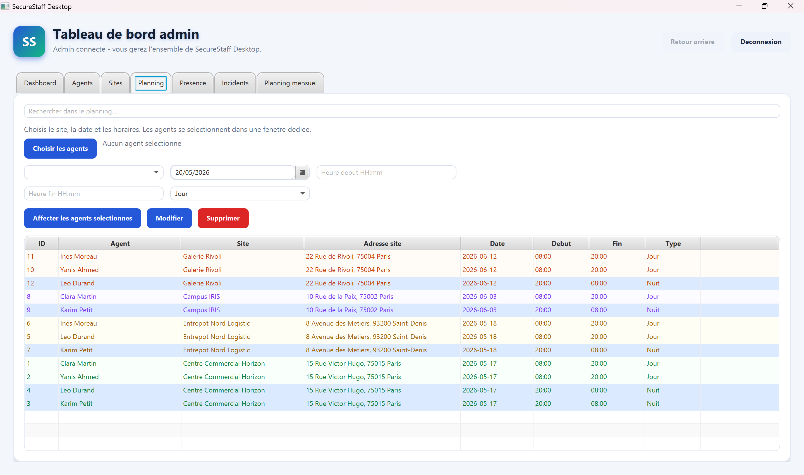
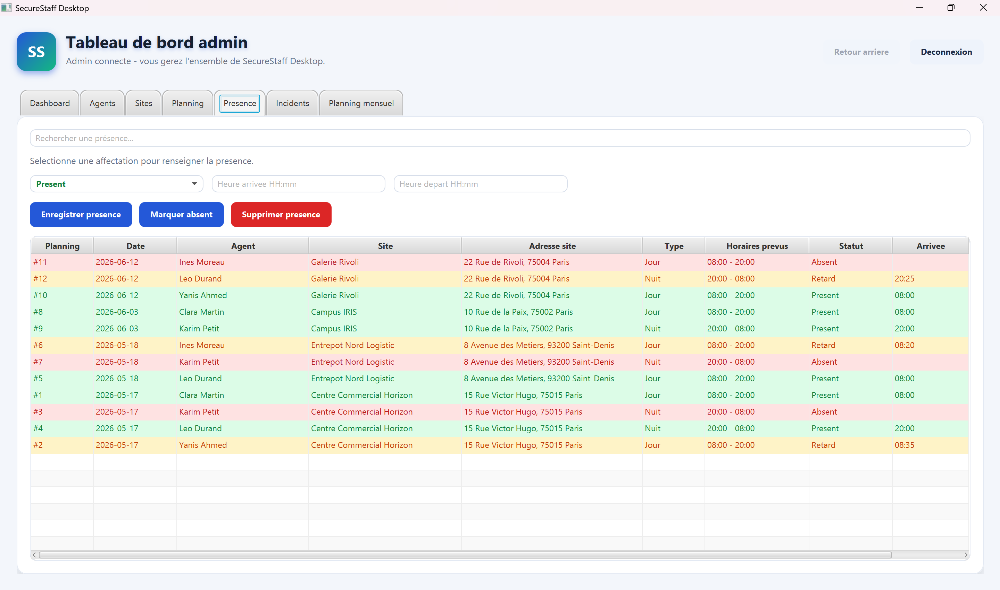
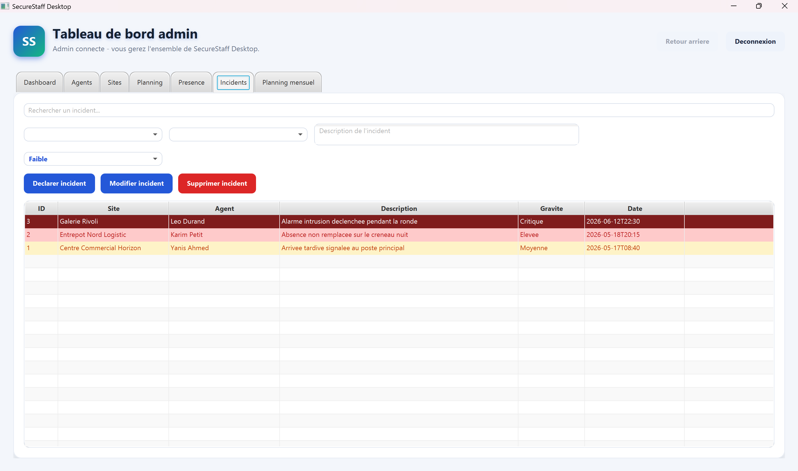
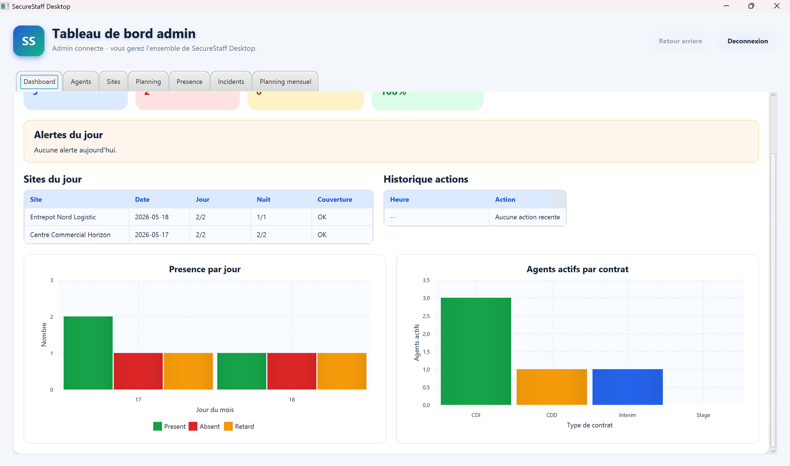
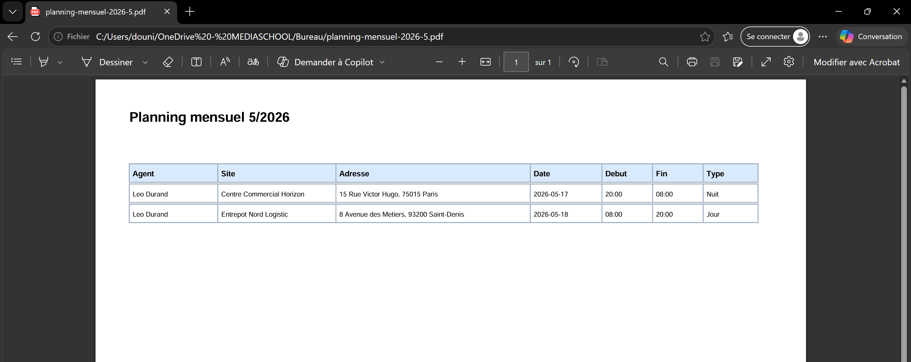

SecureStaff Desktop

Application desktop développée en JavaFX + MySQL dans le cadre d’un stage académique de 2 mois en 2024.

Le projet est inspiré des besoins réels d’une société de sécurité privée et permet de gérer les agents, les sites, les plannings, les présences et les incidents à travers une interface desktop moderne.

Aperçu du projet

SecureStaff Desktop permet de :

gérer les agents de sécurité
gérer les sites clients
organiser les plannings jour/nuit
suivre les présences
déclarer des incidents
visualiser des statistiques et graphiques
exporter des plannings en PDF
sécuriser la connexion administrateur avec BCrypt
Technologies utilisées
Java 17
JavaFX
Maven
MySQL
JDBC
BCrypt
PDFBox
Fonctionnalités principales
Authentification sécurisée
Connexion administrateur
Vérification des mots de passe avec BCrypt
Gestion sécurisée des accès
Dashboard
Statistiques globales
Cartes dynamiques
Graphiques
Analyse mensuelle
Couverture des sites en pourcentage
Alertes du jour
Filtres par contrat
Gestion des agents
Ajouter / modifier / supprimer un agent
Gestion :
téléphone
email
date de naissance
sexe
type de contrat
Validation des emails et téléphones
Contrôle des doublons
Gestion des documents PDF
Gestion des sites
Ajouter / modifier / supprimer un site
Gestion des besoins :
agents jour
agents nuit
Gestion des dates de besoin
Gestion des plannings
Affectation des agents aux sites
Gestion des horaires
Gestion jour / nuit
Affectation multi-agents
Blocage des conflits de planning
Contrôle automatique du nombre d’agents requis
Modification et suppression des affectations
Gestion des présences
Présent
Absent
Retard
Reprise automatique des horaires du planning
Gestion des incidents
Déclaration d’incidents
Gravité des incidents
Modification et suppression
Fonctionnalités supplémentaires
Recherche dynamique
Couleurs de statut
Alertes si un site manque d’agents
Export PDF des plannings
Système de retour arrière (undo)

# Captures d’écran

## Connexion

---

## Dashboard principal

---

## Gestion des agents

---

## Gestion des sites

---

## Gestion des plannings

---

## Gestion des présences

---

## Gestion des incidents

---

## Graphiques et statistiques

## Export PDF des plannings

L’application permet de générer et exporter les plannings des agents en format PDF afin de faciliter le suivi et l’impression des affectations.

Identifiants de démonstration
Login : admin
Mot de passe : admin123
Installation
Prérequis
Java 17 ou supérieur
Maven
MySQL ou XAMPP
Installation de la base de données

Créer une base de données :

CREATE DATABASE securestaff_desktop;

Puis importer :

database/securestaff_desktop.sql

Depuis phpMyAdmin :

Ouvrir phpMyAdmin
Créer la base securestaff_desktop
Cliquer sur Importer
Sélectionner le fichier SQL
Valider
Configuration MySQL

Créer le fichier :

src/main/resources/db.properties

à partir du fichier :

db.properties.example

Exemple :

db.url=jdbc:mysql://localhost:3306/securestaff_desktop?useSSL=false&serverTimezone=Europe/Paris&allowPublicKeyRetrieval=true
db.user=root
db.password=
Lancer le projet

Depuis le dossier du projet :

mvn javafx:run

ou :

mvn org.openjfx:javafx-maven-plugin:0.0.8:run

Ou directement :

run.bat
Structure du projet
SecureStaff-Desktop/
│
├── src/
│   ├── main/java/com/securestaff
│   │   ├── dao/
│   │   ├── db/
│   │   ├── model/
│   │   ├── ui/
│   │   └── MainApp.java
│   │
│   └── resources/
│       ├── style.css
│       ├── db.properties.example
│
├── database/
│   └── securestaff_desktop.sql
│
├── screenshots/
│   ├── login.png
│   ├── dashboard.png
│   ├── agents.png
│   ├── sites.png
│   ├── planning.png
│   ├── presences.png
│   ├── incidents.png
│   └── graphe.png
│
├── pom.xml
├── README.md
├── run.bat
└── .gitignore
Sécurité

Les mots de passe administrateurs sont sécurisés avec BCrypt :

BCrypt.checkpw(password, hashedPassword);

Le fichier réel db.properties est ignoré par Git grâce au .gitignore.

Objectif du projet

Ce projet a été réalisé dans le cadre d’un stage académique de 2 mois en 2024.

L’objectif était de développer une application desktop complète afin de :

pratiquer JavaFX et JDBC
manipuler MySQL
appliquer une architecture DAO
gérer une authentification sécurisée avec BCrypt
concevoir une interface desktop moderne
implémenter des fonctionnalités de gestion RH et planning

Auteur
Dounia Lallouche

Master Développement & Base de Données – École IRIS France